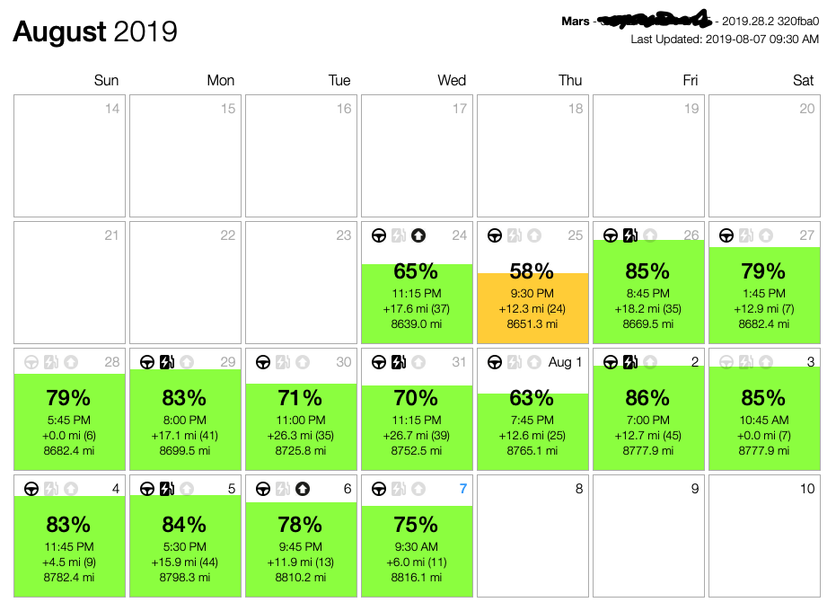

Tesla Data Logger
===

Fetch information from a Tesla vehicle through the unofficial Tesla API (https://www.teslaapi.io).

## Screenshot

A HTML file is generated to present a summary of the last 4 weeks of logs.



## Recommended Setup Procedures

I am using this on a macOS computer and I usually put all open-source software under ~/Developer/. So, the following instructions are how I set it up on my computer. Feel free to deviate for your own preferences. Open a Terminal, first thing is to change directorty to ~/Developer, clone the project through `git`. Then, you will get the folder `tesla` after the successful clone.
```shell
git clone https://github.com/boonleng/tesla.git
```

Run the retrieval script once.
```shell
getStat.py -v -w
```
or
```shell
python getStat.py -v -w
```
which will prompt you for your Tesla account username and password, which will be stored for future use. Don't worry, they are not stored in plain text anywhere. The macOS has a secure way to store this. You can use the Keychain Access utility to remove it if you decided so, just search for `owner-api.teslamotors.com`. The software has not been tested extensively so it is very likely to contain bugs. If you encounter any, please let me know and I'll try my best to fix them.

## Cronjob

Use the _cronjob_ utility to schedule a periodical retrieval. My `cron` table looks like:

```
*/15 * * * *    ${HOME}/Developer/tesla/getStat.py -w
```

NOTE: Update the home path to reflect where you store the scripts.

After a few days, you would end up with a bunch of log files under ${HOME}/Documents/Tesla/

```
.
├── 20190724
│   ├── 20190724-1245.json
│   ├── 20190724-1300.json
│   ├── 20190724-1315.json
│   ├── 20190724-1330.json
.
.
├── 20190725
│   ├── 20190725-0830.json
│   ├── 20190725-0845.json
│   ├── 20190725-0900.json
.
.
```

Congratulations, you are now logging the information from your Tesla vehicle.
